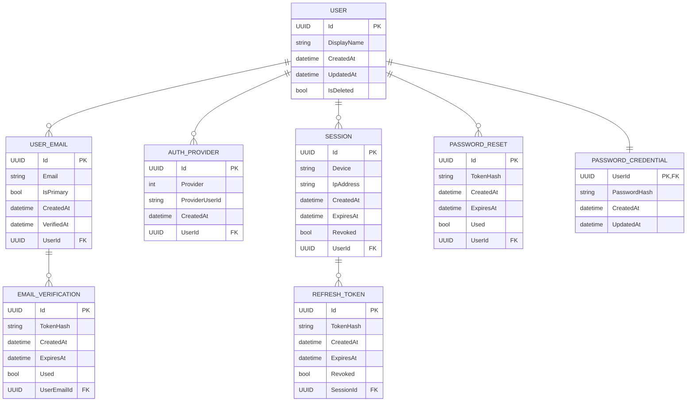

# Auth Service Database

```mermaid
erDiagram
    USER {
        UUID Id PK
        string DisplayName
        datetime CreatedAt
        datetime UpdatedAt
        bool IsDeleted
    }
    USER_EMAIL {
        UUID Id PK
        string Email
        bool IsPrimary
        datetime CreatedAt
        datetime VerifiedAt
        UUID UserId FK
    }
    AUTH_PROVIDER {
        UUID Id PK
        int Provider
        string ProviderUserId
        datetime CreatedAt
        UUID UserId FK
    }
    SESSION {
        UUID Id PK
        string Device
        string IpAddress
        datetime CreatedAt
        datetime ExpiresAt
        bool Revoked
        UUID UserId FK
    }
    REFRESH_TOKEN {
        UUID Id PK
        string TokenHash
        datetime CreatedAt
        datetime ExpiresAt
        bool Revoked
        UUID SessionId FK
    }
    PASSWORD_RESET {
        UUID Id PK
        string TokenHash
        datetime CreatedAt
        datetime ExpiresAt
        bool Used
        UUID UserId FK
    }
    PASSWORD_CREDENTIAL {
        UUID UserId PK,FK
        string PasswordHash
        datetime CreatedAt
        datetime UpdatedAt
    }
    EMAIL_VERIFICATION {
        UUID Id PK
        string TokenHash
        datetime CreatedAt
        datetime ExpiresAt
        bool Used
        UUID UserEmailId FK
    }

    USER ||--o{ USER_EMAIL : ""
    USER ||--o{ AUTH_PROVIDER : ""
    USER ||--o{ SESSION : ""
    SESSION ||--o{ REFRESH_TOKEN : ""
    USER ||--o{ PASSWORD_RESET : ""
    USER ||--|| PASSWORD_CREDENTIAL : ""
    USER_EMAIL ||--o{ EMAIL_VERIFICATION : ""
```
